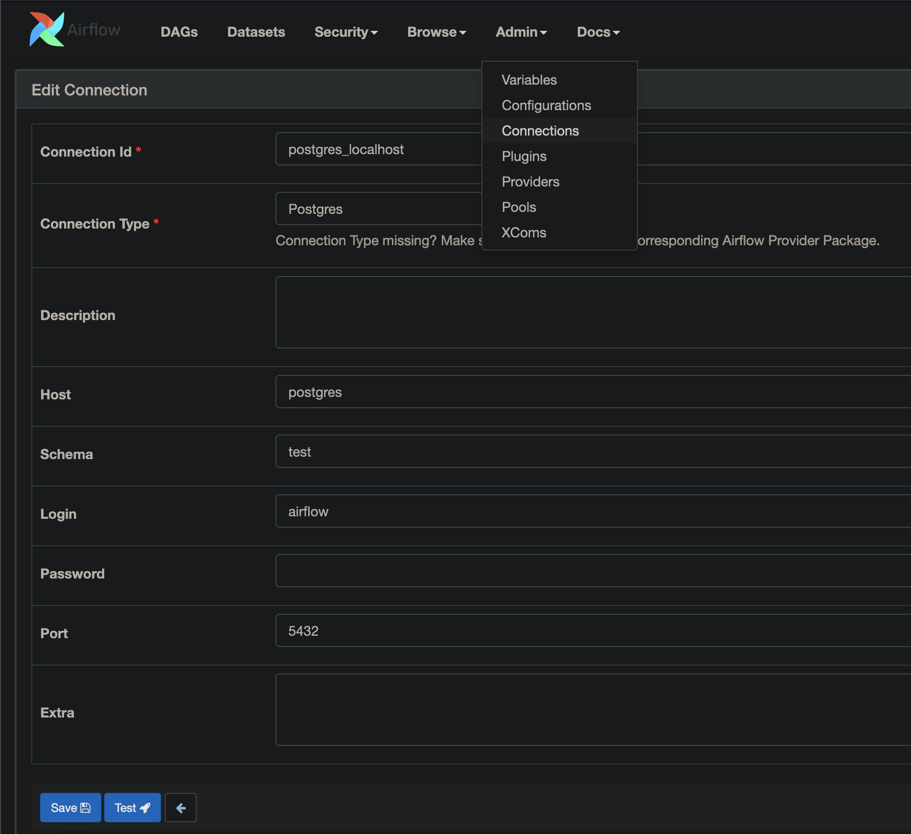

[Ariflow tutorial](https://youtu.be/K9AnJ9_ZAXE)  
**Airflow web UI:** `localhost:8080 `  
username: `admin`  
password: `admin`  

Local environment dependencies installation:  
`pip install apache-airflow apache-airflow-providers-postgres`
Configure postgres provider connection:

https://airflow.apache.org/docs/apache-airflow/1.10.1/start.html

**Minio web UI:**  `localhost:9090`

username, password — 
see environment in docker-compose section:
`MINIO_ROOT_USER`  
`MINIO_ROOT_PASSWORD`
create a bucket `airflow`