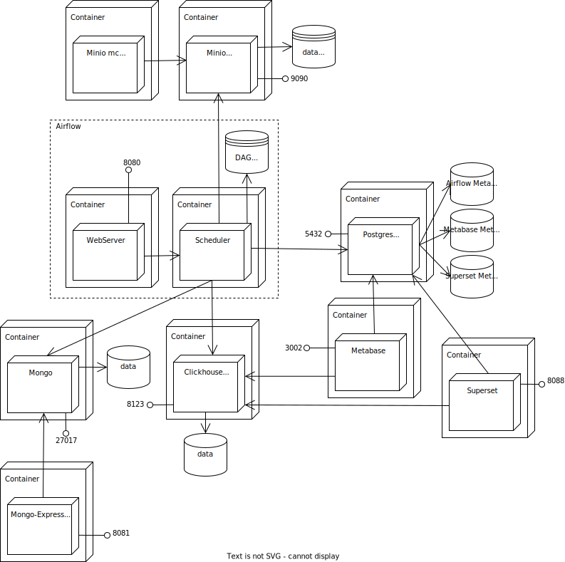

# Data talks 
(Data engineering)

## Overview  
This is a repo of infrastructure configuration and sample data processing code using Python, SQL, Bash and the following tools:

- Apache Airflow (task scheduling)
- ClickHouse (OLAP database)
- dbt (data transformation inside data warehouse)
- Metabase (BI and dashboarding tool)
- Apache Superset (advanced BI and dashboarding tool)

## Projects
1. Data extraction (scraping) from [yellow taxi data html page](https://www.nyc.gov/site/tlc/about/tlc-trip-record-data.page) and ingestion from parquet files into OLAP database.
2. Data ingestion from csv files containing open data set about companies of the world into OLAP DBMS Clickhouse.
3. Data ingestion from csv files containing two months of e-commerce product events into OLAP DBMS Clickhouse.

## Demo

## Stack

- Airflow
- dbt
- Docker
- Bash
- Postgres
- SQL
- ClickHouse
- Metabase
- Superset

## Usage
See readme inside corresponding services
